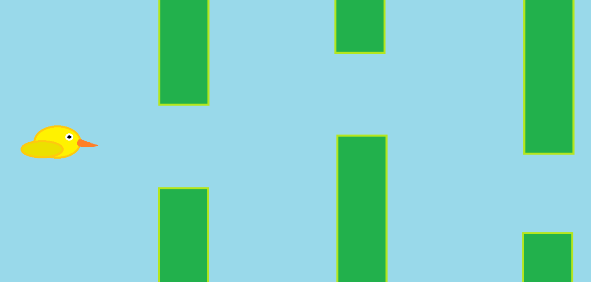

# Steppy Goomba 
Vi startede med at lave en brainstorm over mulige projekter, hvor man ville bruge en tryksensor. Derefter valgte vi en af ideerne og bestemte nogle krav til programmet. Vi valgte projektet “Slappy Bird”, hvilket var en kopi af “Flappy Bird”, men hvor man brugte en tryksensor.  
  
Vi lavede en lav-kvalitets prototype i paint, hvor vi markerede fuglen og styrede den henad i takt med at en af os trykkede på noget, for at simulere hvordan gameplayet ville blive.  
  

For at udnytte tiden bedst muligt valgte vi at finde et projekt der allerede havde lavet en simpel version af “Flappy Bird” vi kunne modificere. Vi endte med at vælge projektet “Crappy Bird” lavet af [kbyte](https://www.ktbyte.com/java-tutorial/game-walkthroughs) da det havde en størrelse der gør det nemt at modificere. Det enest problem var at navngivningen var med vilje dårlig.
```Java
import processing.serial.*;

Serial myPort;

float yspacing = 800/80.00;
String val;
float modY;

void setup() {
  size(600, 800);
  printArray(Serial.list());
  myPort = new Serial(this, Serial.list()[0], 115200);
  println(yspacing);
}
PImage background=loadImage("https://i.imgur.com/y2fKVWZ.png"), bird=loadImage("https://i.imgur.com/gXph7Ya.png");
PImage wall=loadImage("https://i.imgur.com/l9udhQx.png"), menu=loadImage("https://i.imgur.com/rntxEye.png");
int r, s=0, d=1, x, vy, wx[]={0, 0}, wy[]={0, 0}, e=1800, l=600, hs=0, v=800;
float y = 400;

void draw() {
  
  val = myPort.readStringUntil('\n');
  if (val != null) {
    modY = float(val);
    y = 800 - float(val);
    print(y + "\n");
  }
  vy = 0;
  for (int t=0, q=1; t<=e; t+=e, q=1) {
    for (imageMode(1); q>0; q--, imageMode(3)) {
      image(background, x+t, 0);
    }
  }
  for (int i=0, q=(x=x-6==-1800?0:x-6); i<2; i++, fill(0), textSize(40), image(bird, l/2, y)) {
    for (int j=-1; j<2; j+=2, text(""+s, l/2-15, 700)) {
      image(wall, wx[i], wy[i]+j*(wall.height/2+100));
    }
    if ((wx[i]=wx[i]<0?(wy[i]=(int)random(200, v-200))/wy[i]*l:wx[i]-6)==l/2&&d==0) {
      hs=max(++s, hs);
    }
    d = (abs(width/2-wx[i])<25 && abs(y-wy[i])>100) || y > height || y < 0 ? 1 : d;
  } 
  if (d==(r=1)) {
    for (imageMode(1); r>0; r--, rectMode(3), text("HighScore: "+hs, 50, l))
      image(menu, 0, 0);
  }
} 
void mousePressed() {
  x=s=d=0; 
  wx[1]=900;
  wy[0]=(wy[1]=wx[0]=600)-200;
}
```
Derfor startede vi med at finde ud af hvad de forskellig variabler var og gav dem nye navne. Derefter fjernede vi koden der gjorde at “fuglen” fløj og indsatte outputtet fra arduinos serial port, og satte y-værdien til dette.  
  
Først testede vi processing programmet, ved at bruge en analog drejekontakt, hvor vi sendte værdien fra dreje-kontakten over, og brugte den som y-værdi, efter vi havde konstateret at programmet kunne bruge værdien direkte fra arduinoen som y-værdi… Og ja det virkede på første forsøg med dreje-kontakten overraskende nok.  
```C
void setup() {
  Serial.begin(115200);
}

void loop() {
  int measurement = analogRead(A0);
  if(measurement<240) measurement=240;
  if(measurement>400) measurement=400;
  int output = map(measurement, 240, 400, 0, 800);
  Serial.println(output);
  delay(30);
}

```
På arduinoen fandt vi det interval hvor at sensor outputtet var mest stabilt, hvilket var mellem 240 og 400, og derefter begrænsede vi dataen fra arduino til at være mellem disse værdier. Derefter lavede vi på arduinoen kode der læste værdien når den var mellem 240 til 400 og omdannede dette med en map-funktion, så den var i intervallet 0 og 800 og passede procentvis. Derefter sendte vi denne værdi serielt over til processing, hvor den så blev sat som y-værdien.  
  
<a href="https://drive.google.com/file/d/1KYcbtyh6FTVBPi7QabVsb4fBEtThw_c9/preview" width="640" height="480"></a>
